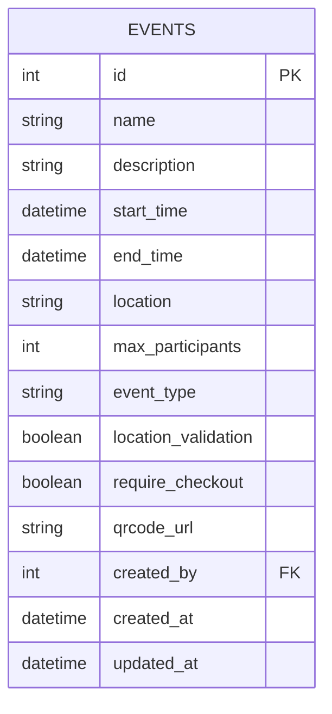
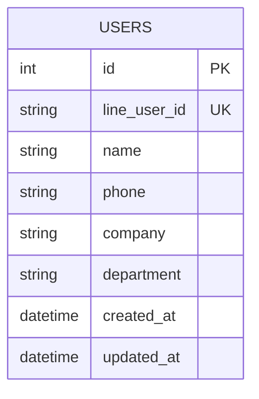
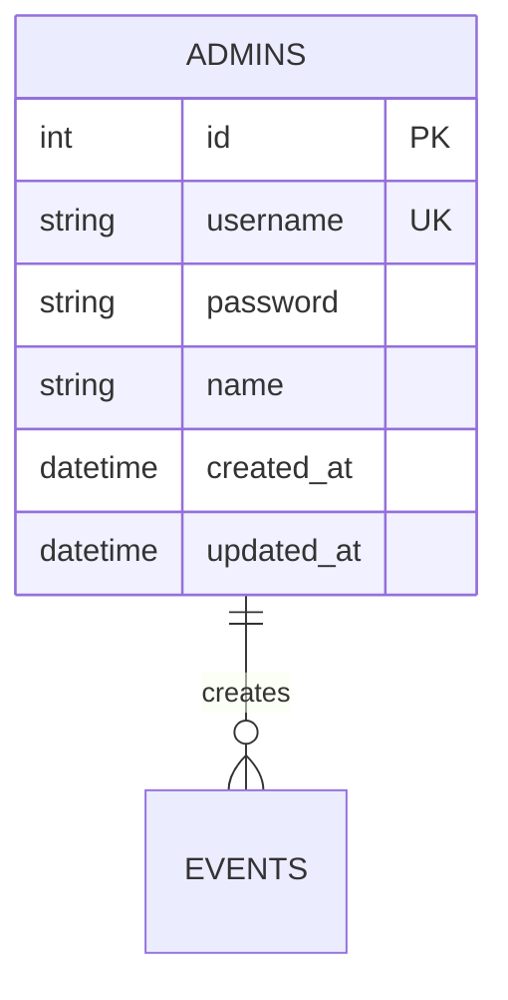
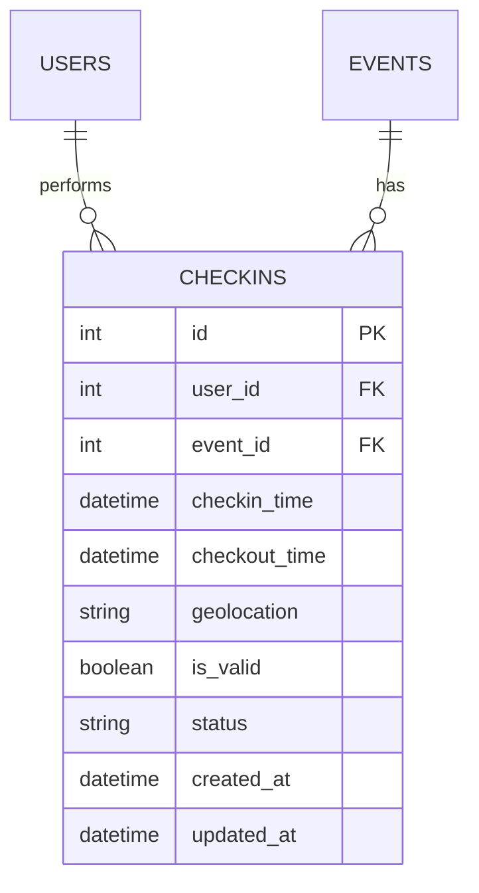
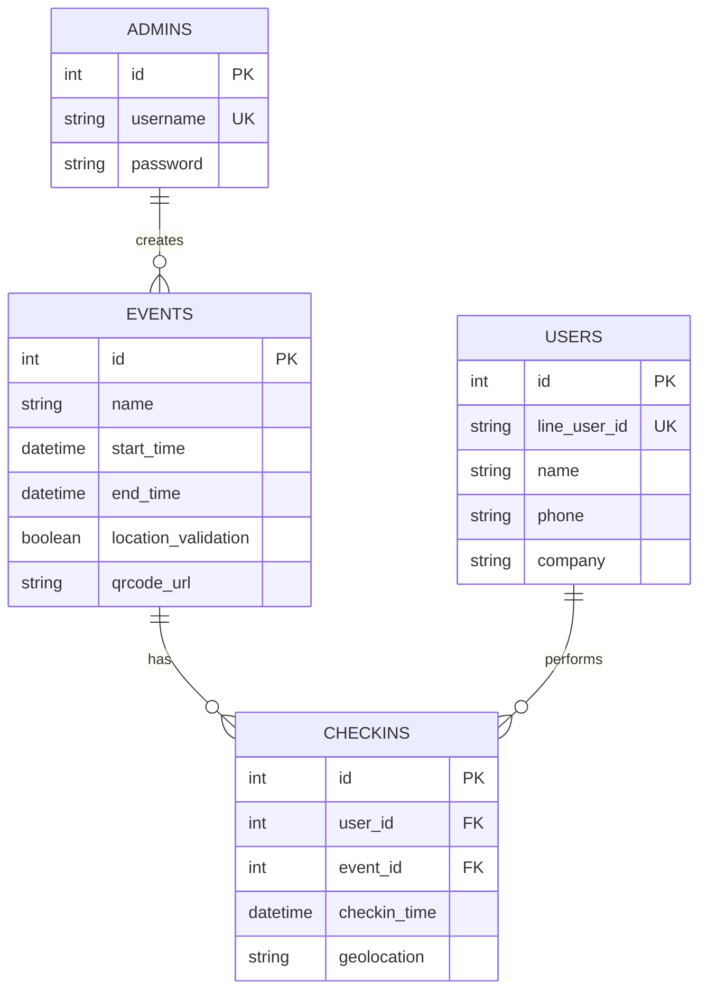
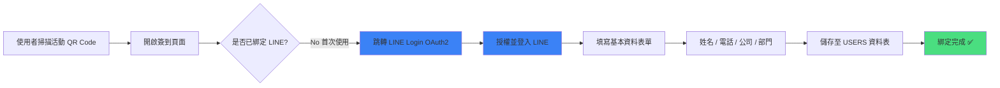
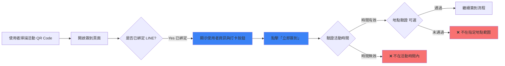
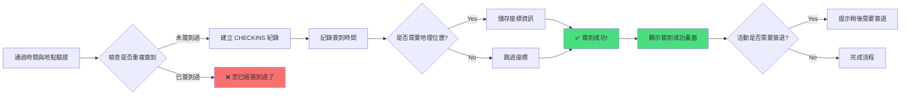

# CheckinFlow

活動簽到系統

結合 LINE Login 的智慧簽到解決方案

<div class="pt-12">
  <span @click="$slidev.nav.next" class="px-2 py-1 rounded cursor-pointer" hover="bg-white bg-opacity-10">
    開始介紹 <carbon:arrow-right class="inline"/>
  </span>
</div>

---
layout: default
---

# 為什麼需要這個專案？

## 傳統簽到方式的痛點

<v-clicks>

- 📝 **重複填寫資料** - 每次活動都要填寫姓名、電話、部門等資訊
- ⏱️ **耗時且效率低** - 排隊簽到浪費大量時間
- ❌ **無法驗證身份** - 表單系統無法確認填寫者是否真的在現場
- 📊 **資料管理困難** - 紙本簽到表或 Google 表單不易統計與匯出
- 🔄 **資料不一致** - 每次手動輸入容易產生錯誤或重複資料

</v-clicks>

<v-click>

<div class="mt-8 p-4 bg-blue-500 bg-opacity-10 rounded-lg">
  <strong>解決方案：</strong> 一次綁定，終身使用！透過 LINE Login 實現快速簽到
</div>

</v-click>

---
layout: two-cols
---

# CheckinFlow 的優勢

## 對使用者

<v-clicks>

- ✨ **首次綁定後，一鍵簽到**
- 📱 **使用熟悉的 LINE 帳號**
- ⚡ **3 秒完成簽到流程**
- 🔒 **資料安全有保障**
- 📝 **可依活動補充額外資訊**

</v-clicks>

::right::

## 對主辦方

<v-clicks>

- 📊 **即時查看簽到統計**
- 📥 **一鍵匯出簽到紀錄**
- 🕒 **自動時間驗證**
- 🎯 **防止代簽與重複簽到**
- 🔗 **產生專屬活動 QR Code**

</v-clicks>

---
layout: default
---

# 🧩 核心功能特色

<div grid="~ cols-2 gap-4" class="mt-4">

<div v-click class="p-4 bg-gradient-to-br from-blue-500 to-blue-600 rounded-lg text-white">
  <div class="text-2xl mb-2">📆</div>
  <h3 class="font-bold mb-2">活動管理</h3>
  <p class="text-sm">建立活動並產生專屬 QR Code，設定時間與地點限制</p>
</div>

<div v-click class="p-4 bg-gradient-to-br from-green-500 to-green-600 rounded-lg text-white">
  <div class="text-2xl mb-2">🔒</div>
  <h3 class="font-bold mb-2">LINE 綁定</h3>
  <p class="text-sm">首次透過 LINE 登入並綁定基本資料，之後快速簽到</p>
</div>

<div v-click class="p-4 bg-gradient-to-br from-purple-500 to-purple-600 rounded-lg text-white">
  <div class="text-2xl mb-2">✅</div>
  <h3 class="font-bold mb-2">智慧驗證</h3>
  <p class="text-sm">時間驗證、地點驗證、防止重複簽到</p>
</div>

<div v-click class="p-4 bg-gradient-to-br from-orange-500 to-orange-600 rounded-lg text-white">
  <div class="text-2xl mb-2">📊</div>
  <h3 class="font-bold mb-2">後台管理</h3>
  <p class="text-sm">查詢、統計、匯出每日打卡紀錄</p>
</div>

</div>

---
layout: default
---

# 🔧 技術架構

<div class="grid grid-cols-2 gap-8 mt-8">

<div>

## 前端技術

- **框架**: Vite + React
- **狀態管理**: Zustand / SWR
- **QR Code**: qrcode.react
- **時間處理**: Day.js
- **樣式**: Tailwind CSS
- **地圖定位**: GoogleMap API

</div>

<div>

## 後端技術

- **API 框架**: Python FastAPI
- **資料庫**: PostgreSQL
- **ORM**: TypeORM
- **認證**: LINE Login 2.1 (OAuth2)
- **JWT**: Token-based Authentication
- **地理位置**: Geopy / Haversine

</div>

</div>

<div v-click class="mt-8 p-4 bg-gray-100 dark:bg-gray-800 rounded-lg">
  <strong>部署環境：</strong> Docker + Vercel/Netlify (前端) + Railway/Render (後端)
</div>

---
layout: two-cols
---

# 📊 資料庫設計 - EVENTS

## 活動資料表

儲存所有活動的基本資訊與設定

**主要欄位：**

- `id` - 活動 ID（主鍵）
- `name` - 活動名稱
- `description` - 活動描述
- `start_time` / `end_time` - 活動時間範圍
- `location` - 地點
- `location_validation` - 是否啟用地點驗證
- `require_checkout` - 是否需要簽退
- `qrcode_url` - 專屬 QR Code
- `created_by` - 創建者（管理員 ID）

::right::

<div class="pl-4">



</div>

---
layout: two-cols
---

# 📊 資料庫設計 - USERS

## 使用者資料表

儲存透過 LINE 綁定的使用者資訊

**主要欄位：**

- `id` - 使用者 ID（主鍵）
- `line_user_id` - LINE 唯一識別碼
- `name` - 姓名（必填）
- `phone` - 電話（必填）
- `company` - 公司（必填）
- `department` - 部門（必填）
- `created_at` / `updated_at` - 建立/更新時間

<div class="mt-4 p-3 bg-blue-50 dark:bg-blue-900 rounded text-sm">
💡 可依活動需求額外欄位，資料會記錄在此表中避免重複填寫
</div>

::right::

<div class="pl-4">



</div>

---
layout: two-cols
---

# 📊 資料庫設計 - ADMINS

## 管理員資料表

管理後台登入帳號與權限

**主要欄位：**

- `id` - 管理員 ID（主鍵）
- `username` - 登入帳號
- `password` - 加密密碼
- `name` - 管理員姓名
- `created_at` / `updated_at` - 建立/更新時間


::right::

<div class="pl-4">



</div>

---
layout: two-cols
---

# 📊 資料庫設計 - CHECKINS

## 簽到紀錄表

記錄所有簽到/簽退行為

**主要欄位：**

- `id` - 紀錄 ID（主鍵）
- `user_id` - 使用者 ID（外鍵）
- `event_id` - 活動 ID（外鍵）
- `checkin_time` - 簽到時間
- `checkout_time` - 簽退時間（選填）
- `geolocation` - 地理位置座標
- `is_valid` - 是否有效
- `status` - 狀態（出席/遲到/早退等）

::right::

<div class="pl-4">



</div>

---
layout: center
---

# 📊 完整資料庫關聯圖



---
layout: default
---

# 🧭 使用者簽到流程（1/3）
<div class="mt-4 p-3 bg-blue-50 dark:bg-blue-900 rounded">
💡 <strong>管理員可依活動需求設定額外欄位</strong>，但資料會記錄在使用者資料表中，不需重複填寫
</div>



---
layout: default
---

# 🧭 使用者簽到流程（2/3）

## 已綁定使用者 - 快速簽到



---
layout: default
---

# 🧭 使用者簽到流程（3/3）

## 簽到驗證與完成



---
layout: default
---

# 🚀 快速啟動

## 安裝與執行

```bash
# 安裝相依套件
yarn install

# 開發模式
yarn dev

# 初始化資料庫
yarn db:init
```

## 環境變數設定

```bash
# 資料庫設定
DB_HOST=localhost
DB_PORT=5432
DB_USERNAME=postgres
DB_PASSWORD=your_password
DB_DATABASE=checkinflow

# LINE Login 設定
LINE_CHANNEL_ID=your_channel_id
LINE_CHANNEL_SECRET=your_channel_secret
LINE_CALLBACK_URL=http://localhost:3000/auth/callback

# JWT 設定
JWT_SECRET=your_jwt_secret
```

---
layout: center
class: text-center
---

# 預設管理員帳號

<div class="text-2xl mt-8">
  <div class="mb-4">
    <strong>帳號：</strong> <code class="text-blue-500">admin</code>
  </div>
  <div>
    <strong>密碼：</strong> <code class="text-blue-500">admin1532698</code>
  </div>
</div>

<div class="mt-12 text-gray-500 text-sm">
  ⚠️ 請在正式環境中務必修改預設密碼
</div>

---
layout: two-cols
---

# 應用場景

<v-clicks>

## 📚 教育場景
- 課堂點名
- 演講活動簽到
- 實驗室簽到

## 🏢 企業場景
- 員工打卡
- 會議簽到
- 培訓課程

</v-clicks>

::right::

<v-clicks>

## 🎉 活動場景
- 研討會報到
- 工作坊簽到
- 社團活動

## 🏥 其他場景
- 志工服務時數
- 場館入場管理
- 訪客登記

</v-clicks>

---
layout: default
---

# 📍 地理位置驗證功能

<div class="grid grid-cols-2 gap-8 mt-8">

<div>

## 功能說明

- 📍 **設定活動地點座標**  
  管理員建立活動時可設定經緯度

- 📏 **自動計算距離**  
  使用 Haversine 公式計算使用者與活動地點的距離

- ✅ **彈性範圍設定**  
  可設定允許的誤差範圍（例如：100 公尺內）

- 🔒 **防止代簽**  
  確保使用者必須實際到場才能簽到

</div>

<div>

## 技術實作

```javascript
// 前端取得使用者位置
navigator.geolocation
  .getCurrentPosition((pos) => {
    const { latitude, longitude } = 
      pos.coords;
    // 傳送座標進行驗證
  });
```

```python
# 後端驗證距離
from geopy.distance import geodesic

def verify_location(user_loc, event_loc):
    distance = geodesic(
      user_loc, event_loc
    ).meters
    return distance <= max_range
```

</div>

</div>

---
layout: end
class: text-center
---

# 感謝聆聽！

CheckinFlow - 讓簽到變得更簡單

<div class="mt-8">
  <a href="https://github.com/foylaou/nkust-checkinflow" target="_blank" class="text-blue-500">
    GitHub Repository
  </a>
</div>

<div class="abs-br m-6 text-sm">
  <carbon:qr-code class="inline"/> 掃描 QR Code 體驗 Demo
  
</div>
